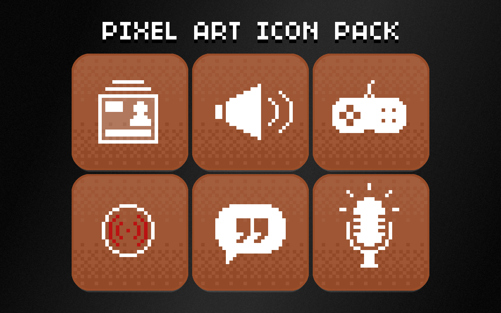

# Stream Deck Pixel Art icon packs v1.1.0

These are 14 free icon packs for the Elgato Stream Deck, based on Pixel Art style.  
**3700+ pixel art icons** (PNG, 288×288px).
- Generic icons packs separated into **12 packs** (with different background colors) with 300 icons per pack.
- A pack of 81 icons to control your applications.
- And finally a palette pack of 45 icons containing just background colors.

---

### Generic icons pack contains 336 icons per pack.
- [Blue background](https://github.com/Nasc/Stream-Deck-Pixel-Art-icon-pack/raw/main/packs/com.nasc.pixelarticonpack.blue.streamDeckIconPack) (.streamDeckIconPack)
- [Charcoal background](https://github.com/Nasc/Stream-Deck-Pixel-Art-icon-pack/raw/main/packs/com.nasc.pixelarticonpack.charcoal.streamDeckIconPack) (.streamDeckIconPack)
- [Green background](https://github.com/Nasc/Stream-Deck-Pixel-Art-icon-pack/raw/main/packs/com.nasc.pixelarticonpack.green.streamDeckIconPack) (.streamDeckIconPack)
- [Navy blue background](https://github.com/Nasc/Stream-Deck-Pixel-Art-icon-pack/raw/main/packs/com.nasc.pixelarticonpack.navyblue.streamDeckIconPack) (.streamDeckIconPack)
- [Olive background](https://github.com/Nasc/Stream-Deck-Pixel-Art-icon-pack/raw/main/packs/com.nasc.pixelarticonpack.olive.streamDeckIconPack) (.streamDeckIconPack)
- [Orange background](https://github.com/Nasc/Stream-Deck-Pixel-Art-icon-pack/raw/main/packs/com.nasc.pixelarticonpack.orange.streamDeckIconPack) (.streamDeckIconPack)
- [Pink background](https://github.com/Nasc/Stream-Deck-Pixel-Art-icon-pack/raw/main/packs/com.nasc.pixelarticonpack.pink.streamDeckIconPack) (.streamDeckIconPack)
- [Purple background](https://github.com/Nasc/Stream-Deck-Pixel-Art-icon-pack/raw/main/packs/com.nasc.pixelarticonpack.purple.streamDeckIconPack) (.streamDeckIconPack)
- [Red background](https://github.com/Nasc/Stream-Deck-Pixel-Art-icon-pack/raw/main/packs/com.nasc.pixelarticonpack.red.streamDeckIconPack) (.streamDeckIconPack)
- [Teal background](https://github.com/Nasc/Stream-Deck-Pixel-Art-icon-pack/raw/main/packs/com.nasc.pixelarticonpack.teal.streamDeckIconPack) (.streamDeckIconPack)
- [Terracotta background](https://github.com/Nasc/Stream-Deck-Pixel-Art-icon-pack/raw/main/packs/com.nasc.pixelarticonpack.terracotta.streamDeckIconPack) (.streamDeckIconPack)
- [Turquoise background](https://github.com/Nasc/Stream-Deck-Pixel-Art-icon-pack/raw/main/packs/com.nasc.pixelarticonpack.turquoise.streamDeckIconPack) (.streamDeckIconPack)

---

### Applications icon pack contains 81 icons.
- [Applications icon pack](https://github.com/Nasc/Stream-Deck-Pixel-Art-icon-pack/raw/main/packs/com.nasc.pixelarticonpack.applications.streamDeckIconPack) (.streamDeckIconPack)

---
### Palette icon pack contains 45 icons.
- [Palette icon pack](https://github.com/Nasc/Stream-Deck-Pixel-Art-icon-pack/raw/main/packs/com.nasc.pixelarticonpack.palette.streamDeckIconPack) (.streamDeckIconPack)

## How to install

1. Download the desired `.streamDeckIconPack` file (all packs are standalone and can be used together)
2. Double click on downloaded file and confirm installation
3. That's all, enjoy!

How to find icon packs on your computer
On macOS, that's `$HOME/Library/Application Support/com.elgato.StreamDeck/IconPacks`,
On Windows it's probably `C:\Users\you\AppData\Roaming\Elgato\StreamDeck\IconPacks`.

## Preview
  
   

 
 
 
 
 
 
 

## Authors & License

This repository and the finished icon packs are under [MIT licensed](LICENSE.md) by
Nasc ([Twitch](https://www.twitch.tv/nasc_pixel), [Twitter](https://twitter.com/NascImpact), [website](http://www.nasc.fr), [Github](https://github.com/Nasc/)).
